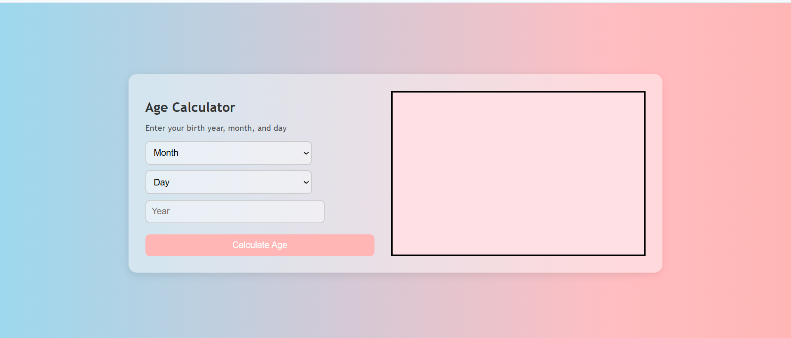
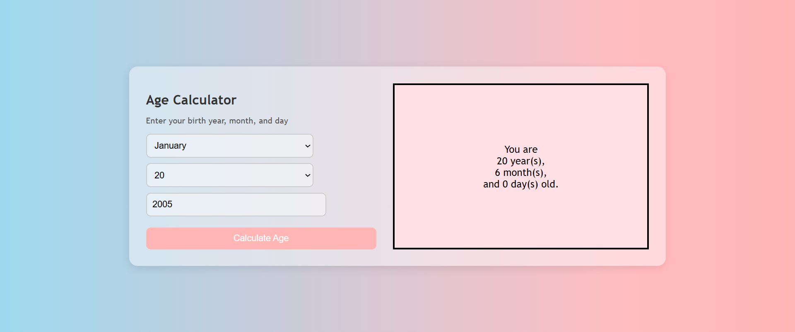

# Age Calculator

A simple and responsive web-based **Age Calculator** built using HTML, CSS, and JavaScript.
## 🔍 Features

- Users can input their **Date of Birth** (Day, Month, Year)
- Calculates and displays **exact age** in **years, months, and days**
- Includes basic **input validation** to prevent invalid dates
- Built using JavaScript's `Date` object for accurate time handling

## 💡 Tech Stack

- HTML – for structuring the input form
- CSS – for basic styling and layout
- JavaScript – for dynamic age calculation

## 📚 Key Concepts

- JavaScript Date & Time handling
- DOM manipulation and event handling
- Form input validation

### 📌 Input Form

### 📊 Age Display Output

